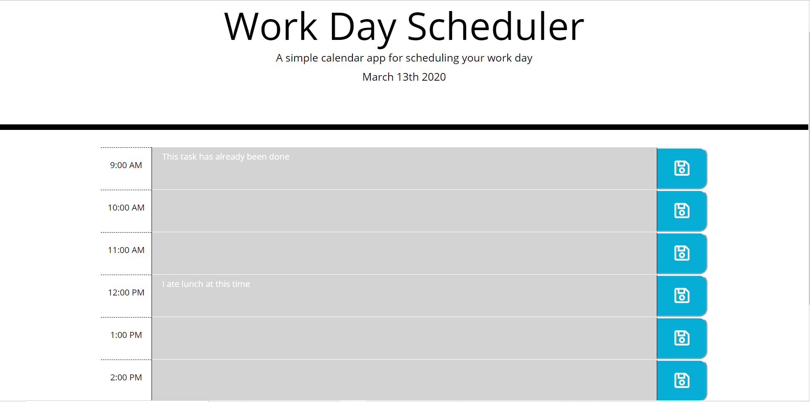

# Homework-05 Work Day Scheduler

## Description
Work day scheduler is a one day scheduling app that allows you to save the task you need to do during the work day. Tasks are written in hour blocks and saved for later viewing. The application is also color coded to let you know what tasks are in the past, what task is at hand in the present, and what tasks are still left to do in the future. 

## Screenshots

## Resources
Bootstrap was largely used for the styling. Moment.js was used for any date logic. 